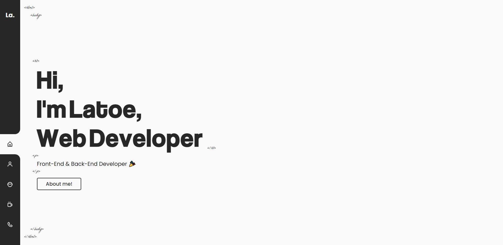

# Latoe's Homepage

[https://lazlanrafar.vercel.app/](https://lazlanrafar.vercel.app/)

<!--  -->

## Referensi

- [https://jacekjeznach.com](https://jacekjeznach.com/)
- [https://gunawanahmad.me](https://gunawanahmad.me/)
- [https://www.craftz.dog](https://www.craftz.dog/)

## Stack

- [Vue.js](https://vuejs.org/) - A JavaScript framework for building user interfaces. It builds on top of standard HTML, CSS, and JavaScript

## Project Strcuture

```
$PROJECT_ROOT
├── assets
│   ├─── fonts
│   ├─── images
│   ├─── scss
│
├── components
│   ├─── atoms
│   ├─── molecules
│   ├─── organims
│
├── mixins
│   #
├── router
│   #
├── store
│   #
├── views
│   #

```
